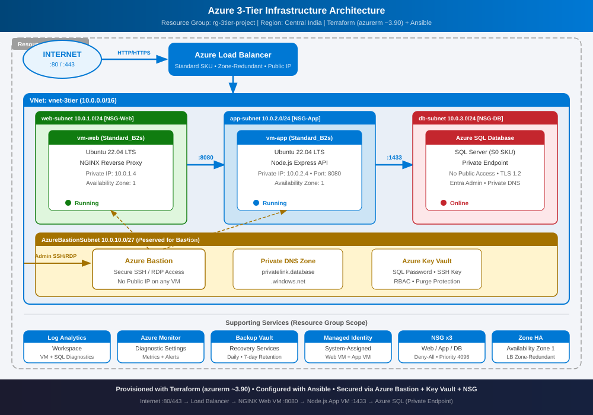

# Azure 3-Tier Infrastructure Project

A production-style Azure infrastructure project provisioned entirely with **Terraform** and configured with **Ansible** and cloud-init scripts.



---

## Architecture Overview

```text
Internet
   ↓ :80 / :443
Azure Load Balancer  (Standard, zone-redundant public IP)
   ↓ :80
Web VM  — Ubuntu 22.04 · Standard_B2s · NGINX reverse proxy
   ↓ :8080
App VM  — Ubuntu 22.04 · Standard_B2s · Node.js 20 LTS · Express API
   ↓ :1433 (private endpoint only)
Azure SQL Database  — S0 SKU · TLS 1.2 · Entra admin · Private DNS zone
```

### Tier Details

| Tier     | Resource         | Details                                           |
|----------|------------------|---------------------------------------------------|
| Web      | `vm-web`         | Ubuntu 22.04, Standard_B2s, NGINX, port 80        |
| App      | `vm-app`         | Ubuntu 22.04, Standard_B2s, Node.js 20, port 8080 |
| Database | Azure SQL Server | `sqlsvr-3tier-<suffix>`, S0, private endpoint     |

---

## Azure Services Used

| Service                        | Purpose                                         |
|--------------------------------|-------------------------------------------------|
| Virtual Network (VNet)         | Network isolation — `10.0.0.0/16`               |
| Subnets × 4                    | Tier separation + Bastion subnet                |
| Network Security Groups × 3    | Per-tier inbound / outbound rules               |
| Azure Load Balancer (Standard) | Public traffic distribution to Web VM           |
| Virtual Machines × 2           | Web tier (NGINX) + App tier (Node.js)           |
| Azure Bastion                  | Secure browser-based SSH — no public IP on VMs  |
| Azure SQL Database             | Managed relational DB, S0 SKU                   |
| Private Endpoint               | SQL accessible only inside VNet (`10.0.3.x`)    |
| Private DNS Zone               | `privatelink.database.windows.net`              |
| Azure Key Vault                | Stores SQL admin password                       |
| Managed Identity (System)      | Both VMs authenticate to Key Vault via RBAC     |
| Azure Monitor + Log Analytics  | Metrics, diagnostics, and log aggregation       |
| Azure Backup                   | Daily VM backup, 7-day retention                |
| Public IP (Standard)           | Load balancer front-end                         |

---

## Network Design

| Subnet               | CIDR            | Purpose                     |
|----------------------|-----------------|-----------------------------------------|
| `web-subnet`         | `10.0.1.0/24`   | Web VM (NGINX)                          |
| `app-subnet`         | `10.0.2.0/24`   | App VM (Node.js) — private               |
| `db-subnet`          | `10.0.3.0/24`   | SQL private endpoint                    |
| `AzureBastionSubnet` | `10.0.10.0/27`  | Azure Bastion host                      |

---

## Repository Structure

```text
azure-3tier-infrastructure-project/
│
├── terraform/
│   ├── provider.tf         # AzureRM + random providers, remote state config
│   ├── variables.tf        # All input variables with defaults
│   ├── terraform.tfvars    # Override values (region, SQL password, etc.)
│   ├── main.tf             # Resource Group, Key Vault, Log Analytics, Backup
│   ├── vnet.tf             # VNet, subnets, Bastion
│   ├── vm.tf               # Web VM + App VM, NICs, Load Balancer, cloud-init
│   ├── nsg.tf              # NSG rules for all three tiers
│   ├── sql.tf              # Azure SQL Server, Database, Private Endpoint, DNS
│   └── outputs.tf          # SQL FQDN, VM IPs, Key Vault URI, LB public IP
│
├── scripts/
│   ├── app.sh              # Cloud-init: Node.js 20, Express API, systemd service
│   └── web.sh              # Cloud-init: NGINX + live dashboard deployment
│
├── ansible/
│   ├── inventory           # Target hosts (web VM)
│   └── web-config.yml      # Copies web/index.html to Web VM via Ansible
│
├── web/
│   └── index.html          # Modern Azure dashboard (canonical source)
│
├── architecture/
│   └── architecture-diagram.svg
│
└── README.md
```

---

## Prerequisites

- [Terraform](https://developer.hashicorp.com/terraform/install) ≥ 1.6
- [Azure CLI](https://learn.microsoft.com/cli/azure/install-azure-cli) — authenticated (`az login`)
- [Ansible](https://docs.ansible.com/ansible/latest/installation_guide/) ≥ 2.14 (for web config)
- An Azure subscription with Contributor + Key Vault Administrator rights

---

## Deployment

### 1. Configure variables

Edit `terraform/terraform.tfvars` with your values:

```hcl
location            = "Central India"
resource_group_name = "rg-3tier-project"
sql_admin_password  = "YourStr0ng!Password"   # min 8 chars, upper/lower/digit/special
environment         = "dev"
```

### 2. Provision infrastructure

```bash
cd terraform
terraform init
terraform plan -out=tfplan
terraform apply tfplan
```

Key outputs after apply:

```bash
terraform output load_balancer_public_ip   # open in browser for the dashboard
terraform output sql_server_fqdn           # e.g. sqlsvr-3tier-abc123.database.windows.net
terraform output app_vm_private_ip         # e.g. 10.0.2.4
terraform output web_vm_private_ip         # e.g. 10.0.1.4
```

### 3. Configure the App VM — DB credentials

After `terraform apply`, connect to the App VM via **Azure Bastion** and populate `/opt/app/.env`:

```bash
sudo nano /opt/app/.env
```

```ini
DB_SERVER=sqlsvr-3tier-<suffix>.database.windows.net
DB_NAME=appdb
DB_USER=azureadmin
DB_PASS=YourStr0ng!Password
PORT=8080
```

```bash
sudo chmod 600 /opt/app/.env
sudo chown nobody /opt/app/.env
sudo systemctl restart app-tier
```

### 4. Initialise the database schema

```bash
curl -X POST http://10.0.2.4:8080/db/setup
# Returns: { "message": "Schema ready", "rows_inserted": 5 }
```

### 5. Deploy the web dashboard (Ansible)

```bash
cd ansible
ansible-playbook -i inventory web-config.yml
```

---

## App Tier — API Endpoints

All endpoints are served on port `8080` on `vm-app` and exposed via NGINX at `/api/*` on the Load Balancer public IP.

| Method | Path         | Description                                               |
|--------|--------------|-----------------------------------------------------------|
| GET    | `/health`    | Static health check — always returns `{ status: "ok" }`  |
| GET    | `/db-status` | SQL connectivity check — server version, DB name, time   |
| GET    | `/db/tables` | Lists all base tables in the connected database           |
| POST   | `/db/setup`  | Idempotent — creates `items` table and seeds 5 rows       |
| GET    | `/items`     | Returns items from DB; falls back to 3 static items       |

Example:

```bash
LB_IP=$(cd terraform && terraform output -raw load_balancer_public_ip)
curl http://$LB_IP/api/db-status
curl http://$LB_IP/api/items
```

---

## Web Dashboard

`web/index.html` is a modern, real-time infrastructure dashboard deployed to the Web VM by Ansible. Features:

- **Stats cards** — VM count, subnets, SQL databases, NSG rules, backup status
- **3-Tier Architecture** flow diagram
- **Azure Services** grid (14 services)
- **Network Design** — subnet table
- **Traffic Flow** — port-annotated flow diagram
- **Database Tier — Live Status** panel:
  - Connection indicator dot (green/red) polled every 30 seconds
  - Server metadata (name, DB, server time UTC, endpoint, TLS, SKU)
  - Live `items` table with Refresh button


---

## Security Practices Implemented

| Control                     | Implementation                                               |
|-----------------------------|--------------------------------------------------------------|
| No public IP on App VM      | App VM is private; reachable only via Bastion or Web VM      |
| SQL — no public access      | Private endpoint only; public network access disabled        |
| TLS 1.2 minimum             | Enforced on SQL Server (`minimum_tls_version = "1.2"`)       |
| Secrets in Key Vault        | SQL admin password stored as a Key Vault secret              |
| Managed Identity            | Both VMs use SystemAssigned identity for Key Vault RBAC      |
| NSG per tier                | Separate NSGs restrict inbound traffic to required ports only |
| Entra (AAD) SQL admin       | Azure AD admin set on SQL Server alongside SQL auth          |
| Disk encryption             | Azure-managed disk encryption enabled by default             |
| Azure Bastion               | SSH over TLS 443 — no inbound SSH port exposed on NSGs       |

---

## Key Terraform Variables

| Variable               | Default            | Description                        |
|------------------------|--------------------|-----------------------------------------|
| `location`             | `Central India`    | Azure region                            |
| `resource_group_name`  | `rg-3tier-project` | Resource group name                     |
| `environment`          | `dev`              | Environment tag                         |
| `web_vm_size`          | `Standard_B2s`     | Web VM SKU                              |
| `app_vm_size`          | `Standard_B2s`     | App VM SKU                              |
| `sql_admin_login`      | `azureadmin`       | SQL Server admin username               |
| `sql_admin_password`   | *(required)*       | SQL Server admin password               |
| `sql_database_name`    | `appdb`            | Azure SQL Database name                 |
| `sql_sku`              | `S0`               | SQL Database service objective          |

---

## Terraform Outputs

| Output                    | Description                               |
|---------------------------|-------------------------------------------|
| `resource_group_name`     | Resource group name                       |
| `vnet_id`                 | Virtual Network resource ID               |
| `load_balancer_public_ip` | Public IP of the Azure Load Balancer      |
| `web_vm_private_ip`       | Private IP of Web VM (`10.0.1.x`)         |
| `app_vm_private_ip`       | Private IP of App VM (`10.0.2.x`)         |
| `sql_server_fqdn`         | Fully qualified domain name of SQL Server |
| `sql_database_name`       | Name of the Azure SQL Database            |

---

## Resume Points

- Designed and provisioned production-style Azure 3-tier architecture using Terraform.
- Configured per-tier NSGs, Azure Load Balancer, and private subnet isolation.
- Deployed Ubuntu VMs with cloud-init: NGINX reverse proxy (Web) and Node.js 20 Express API (App).
- Integrated Azure SQL Database via private endpoint — no public internet exposure.
- Stored SQL credentials in Azure Key Vault; VMs authenticate via SystemAssigned Managed Identity.
- Built a live infrastructure dashboard (HTML/CSS/JS) that polls real-time DB status and items.
- Automated Web VM configuration with Ansible.
- Implemented Azure Bastion for keyless, browser-based SSH — eliminating exposed SSH ports.
- Applied TLS 1.2 minimum, Entra admin, and disk encryption across all resources.

---

## Interview Topics Covered

- VNet & subnet design, CIDR planning
- NSG rules — per-tier inbound/outbound control
- Azure Load Balancer (Standard) — health probes, backend pools
- Azure Bastion — secure SSH without public IP exposure
- Private Endpoints & Private DNS Zones — SQL inside VNet only
- Azure Key Vault — secret management with RBAC
- Managed Identity (SystemAssigned) — passwordless Azure resource auth
- Terraform — resource graph, state management, `outputs.tf`, `variables.tf`
- Ansible — inventory, playbooks, file copy tasks
- Cloud-init — VM bootstrap scripts, systemd services
- Azure Monitor & Log Analytics — diagnostics and log aggregation
- Azure Backup — vault, policy, daily retention
- Azure SQL — DTU model (S0), private networking, Entra admin
